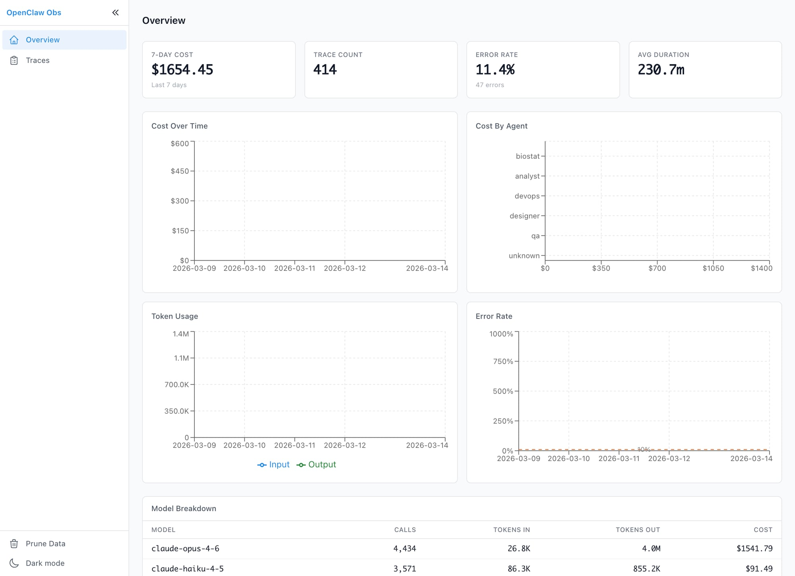
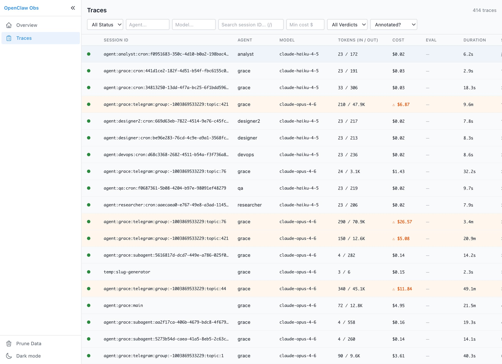
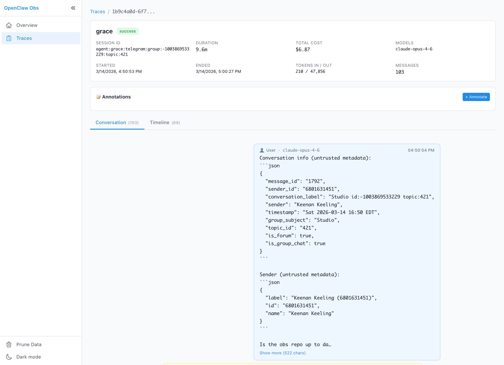

# openclaw-obs

Local-first observability for [OpenClaw](https://github.com/openclaw/openclaw) AI agents. See what your agents are doing, what they cost, and where they're failing — all from a single dashboard running on your machine.

**Zero data leaves your machine.** Everything is stored in a local SQLite database.

### Cost & token analytics at a glance


### Every session, filterable and searchable


### Full conversation replay with tool calls


---

## Why You Need This

Running AI agents without observability is like driving with your eyes closed. You'll hit something expensive.

- **Cost visibility** — Know exactly what each agent, model, and session costs. Catch runaway spending before it becomes a $60 overnight heartbeat bill.
- **Debugging** — Full conversation replay: every user message, assistant response, tool call, and error. See exactly what happened in any session.
- **Performance** — Token counts, latency, model usage breakdown. Find bottlenecks and optimize.
- **Sub-agent tracking** — Traces link parent ↔ child sessions so you can follow work across spawned agents.
- **Error monitoring** — Failed sessions surface immediately with full context.

If you run OpenClaw agents, install this first.

## What It Captures

| Event | What's Recorded |
|-------|----------------|
| Sessions | Start/end, status, agent name, duration |
| LLM calls | Model, tokens in/out, cost, full messages |
| Tool calls | Name, inputs, outputs, errors, timing |
| Sub-agents | Spawned/ended, linked to parent trace |
| Messages | Complete conversation history per session |

All events are buffered in memory and flushed in batches — minimal performance impact on your gateway.

## Dashboard

The built-in web dashboard gives you:

- **Overview** — Total cost, token usage, error rate, per-agent and per-model breakdowns, daily trends
- **Trace List** — Filterable list of all sessions with status, agent, model, cost, duration
- **Trace Detail** — Waterfall timeline of every span in a session
- **Conversation Browser** — Chat-style replay of full sessions with expandable tool calls

Access it locally or share via Cloudflare tunnel for mobile/remote viewing.

---

## Installation Guide for OpenClaw Agents

> **This section is written for OpenClaw agents.** If your operator gives you this repo URL and asks you to install it, follow these steps exactly.

### Prerequisites

- OpenClaw gateway running (verify with `openclaw status`)
- Node.js 20+ (`node --version`)
- npm (`npm --version`)
- Git (`git --version`)

### Step 1: Clone and Build

```bash
# Clone into ~/projects (create if needed)
mkdir -p ~/projects
cd ~/projects
git clone https://github.com/kkeeling/openclaw-obs.git
cd openclaw-obs

# Install dependencies and build the plugin
npm install
npm run build

# Install and build the dashboard
cd dashboard
npm install
npm run build
cd ..
```

### Step 2: Link the Plugin to OpenClaw

```bash
# From the openclaw-obs directory:
cd ~/projects/openclaw-obs
openclaw plugins install --link .
```

This registers the plugin with OpenClaw via the `openclaw.plugin.json` manifest. The gateway will load it on next restart.

### Step 3: Create the Database Directory

```bash
mkdir -p ~/.openclaw/observability
```

The SQLite database (`traces.db`) is created automatically on first run.

### Step 4: Restart the Gateway

```bash
openclaw gateway restart
```

The plugin is now active. Every session, LLM call, and tool invocation will be recorded.

### Step 5: Start the Dashboard

```bash
cd ~/projects/openclaw-obs
node dist/cli.js
```

The dashboard launches at **http://127.0.0.1:19100** (auto-increments port if 19100 is taken).

To verify it's working, open the URL in a browser or:

```bash
curl -s http://127.0.0.1:19100/api/health | head -c 200
```

### Step 6 (Optional): Remote Access via Cloudflare Tunnel

For viewing the dashboard from a phone or another machine:

```bash
# Install cloudflared if not present
# macOS: brew install cloudflared
# Linux: see https://developers.cloudflare.com/cloudflare-one/connections/connect-networks/downloads/

# Start a quick tunnel (no account needed)
nohup cloudflared tunnel --url http://127.0.0.1:19100 &>/tmp/cloudflared-obs.log &
sleep 5
grep -o 'https://[a-z0-9-]*\.trycloudflare\.com' /tmp/cloudflared-obs.log
```

The printed URL is publicly accessible. Share it with your operator.

### Step 7 (Optional): Run Dashboard on Boot

To keep the dashboard running persistently, add it to a process manager or use a background script:

```bash
# Simple background start
nohup node ~/projects/openclaw-obs/dist/cli.js &>/tmp/obs-dashboard.log &
```

### Configuration

All configuration is via environment variables — no config files needed:

| Variable | Default | Description |
|----------|---------|-------------|
| `OPENCLAW_OBS_PORT` | `19100` | Dashboard server port |
| `OPENCLAW_OBS_DB_PATH` | `~/.openclaw/observability/traces.db` | SQLite database path |
| `OPENCLAW_OBS_RETENTION_DAYS` | `7` | Auto-prune traces older than N days |
| `OPENCLAW_OBS_MAX_DB_MB` | `0` (unlimited) | Max DB size — oldest traces pruned when exceeded |
| `OPENCLAW_OBS_MAX_PAYLOAD_KB` | `10` | Max stored LLM input/output payload size |

### Pruning & Maintenance

Traces are automatically pruned on startup and periodically while the plugin runs:

- **Time-based**: Traces older than `OPENCLAW_OBS_RETENTION_DAYS` are deleted
- **Size-based**: If `OPENCLAW_OBS_MAX_DB_MB` is set, oldest traces are removed until under the limit
- **Manual**: `POST /api/prune` triggers immediate pruning + VACUUM

### Verifying the Install

After restarting the gateway, trigger any agent session (send a message, run a heartbeat, etc.), then check:

```bash
sqlite3 ~/.openclaw/observability/traces.db "SELECT id, agent_name, status FROM traces ORDER BY started_at DESC LIMIT 5;"
```

If you see traces, it's working. Open the dashboard to explore.

### Troubleshooting

| Problem | Fix |
|---------|-----|
| No traces appearing | Verify plugin is loaded: `openclaw plugins list` should show `openclaw-obs`. Restart gateway if needed. |
| Dashboard won't start | Check if port 19100 is in use: `lsof -i :19100`. Set `OPENCLAW_OBS_PORT=19101` to use a different port. |
| Build fails | Ensure Node 20+. Delete `node_modules` and `npm install` again. |
| Database locked errors | The DB uses WAL mode for concurrency. If issues persist, stop the dashboard, run `sqlite3 traces.db "PRAGMA wal_checkpoint(TRUNCATE);"`, and restart. |

---

## API Reference

All endpoints are served from the dashboard server:

| Method | Endpoint | Description |
|--------|----------|-------------|
| `GET` | `/api/traces` | List traces (filters: `status`, `agent`, `model`, `since`, `until`, `minCost`, `search`, `limit`, `offset`) |
| `GET` | `/api/traces/:id` | Trace detail with spans, messages, and child traces |
| `GET` | `/api/traces/:id/messages` | Conversation messages for a trace |
| `GET` | `/api/stats` | Aggregated analytics (filters: `since`, `until`) |
| `GET` | `/api/health` | Health check — DB size, trace count, retention config |
| `POST` | `/api/prune` | Manual prune + VACUUM |

## Architecture

```
openclaw-obs/
├── src/
│   ├── plugin/
│   │   ├── index.ts       # OpenClaw plugin hooks — event capture + buffering
│   │   ├── db.ts          # SQLite schema, queries, pruning, migrations
│   │   ├── buffer.ts      # In-memory event buffer with batch flush
│   │   └── pricing.ts     # Model cost calculations
│   ├── server/
│   │   ├── index.ts       # Express server + SPA static file serving
│   │   └── routes.ts      # REST API endpoints
│   └── cli.ts             # Standalone CLI entry point
├── dashboard/             # React + Vite SPA
│   └── src/
│       ├── views/         # TraceList, TraceDetail, Overview
│       ├── components/    # ConversationView, SubAgentLinks
│       └── hooks/         # useApi data fetching
└── openclaw.plugin.json   # Plugin manifest for OpenClaw discovery
```

**Data flow:** OpenClaw gateway → plugin hooks → EventBuffer → SQLite (WAL) → Express API → React dashboard

## License

MIT
